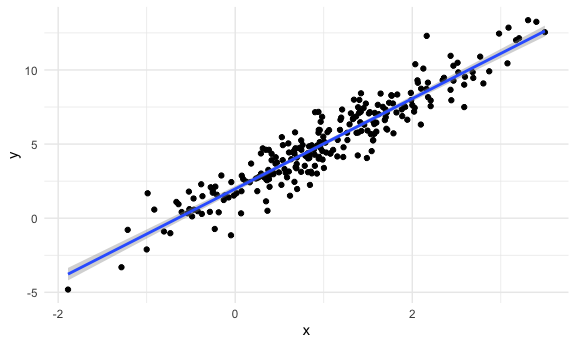
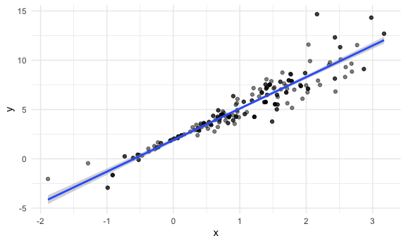
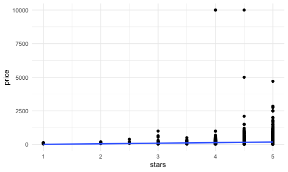
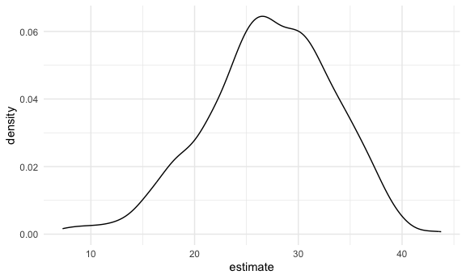

Boostrap
================

``` r
library(tidyverse)
library(modelr)
library(p8105.datasets)
set.seed(1)
```

do some boostrapping

make up some data

``` r
n_samp = 250

sim_df_constant = 
  tibble(
    x = rnorm(n_samp, 1,1),
    error = rnorm(n_samp, 0, 1),
    y = 2 + 3*x + error
  )

sim_df_nonconstant = 
  sim_df_constant |>
  mutate(
    error = error * .75 * x,
    y = 2 + 3*x + error
  )
```

look at these.

``` r
sim_df_constant |>
  ggplot(aes(x = x, y = y))+
  geom_point()+
  stat_smooth(method = "lm")
```

    ## `geom_smooth()` using formula = 'y ~ x'



look ar regression

``` r
sim_df_constant |>
  lm(y ~ x, data = _) |>
  broom::tidy()|>
  knitr::kable(digits = 3)
```

| term        | estimate | std.error | statistic | p.value |
|:------------|---------:|----------:|----------:|--------:|
| (Intercept) |    1.977 |     0.098 |    20.157 |       0 |
| x           |    3.045 |     0.070 |    43.537 |       0 |

## draw a boostrap sample.

``` r
boot_sample = function(df) {
  
  boot_df = 
    sample_frac(df, replace = TRUE) |>
    arrange(x)
  
  return(boot_df)
}
```

running this

``` r
sim_df_nonconstant|>
  boot_sample()|>
  ggplot(aes(x = x, y = y))+
  geom_point(alpha = .5)+
  stat_smooth(method = "lm")
```

    ## `geom_smooth()` using formula = 'y ~ x'



can we do this as part of an analysis?

``` r
sim_df_nonconstant|>
  lm(y ~ x, data = _) |>
  broom::tidy()|>
  knitr::kable(digits = 3)
```

| term        | estimate | std.error | statistic | p.value |
|:------------|---------:|----------:|----------:|--------:|
| (Intercept) |    1.934 |     0.105 |    18.456 |       0 |
| x           |    3.112 |     0.075 |    41.661 |       0 |

## boostrap

``` r
boot_straps = 
  tibble(
    strap_number = 1:1000,
  )|>
  mutate(
    strap_sample = map(strap_number, \(i) boot_sample(df = sim_df_nonconstant)),
    models = map(strap_sample, \(df) lm(y ~ x, data = df)),
    results = map(models, broom::tidy)
  )

bootstrap_results = 
  boot_straps |>
  select(strap_number, results)|>
  unnest(results)|>
  group_by(term)|>
  summarise(
    boot_se = sd(estimate)
  )|>
  knitr::kable(digits = 3)
```

## do this all using modelr

``` r
boot_straps = 
  sim_df_nonconstant|>
  modelr::bootstrap(1000)|>
  mutate(
    strap = map(strap, as_tibble),
    models = map(strap, \(df) lm(y ~ x, data = df)),
    results = map(models, broom::tidy)
  )|>
  select(.id, results)|>
  unnest(results)
```

## what do you want to report

``` r
boot_straps |>
  group_by(term) |>
  summarise(
    boot_est = mean(estimate),
    boot_se = sd(estimate),
    boot_ci_ll = quantile(estimate, .025),
    boot_ci_ul = quantile(estimate, .975)
  )
```

    ## # A tibble: 2 × 5
    ##   term        boot_est boot_se boot_ci_ll boot_ci_ul
    ##   <chr>          <dbl>   <dbl>      <dbl>      <dbl>
    ## 1 (Intercept)     1.93  0.0762       1.79       2.08
    ## 2 x               3.11  0.104        2.92       3.32

## airbnb

``` r
data("nyc_airbnb")

manhattan_df = 
nyc_airbnb |>
  mutate(stars = review_scores_location/2)|>
  rename(borough = neighbourhood_group, neighborhood = neighbourhood) |>
  filter(borough == "Manhattan")|>
  select(price, stars, room_type)|>
  drop_na()
```

plot the data

``` r
manhattan_df |>
  ggplot(aes(x = stars, y = price))+
  geom_point()+
  stat_smooth(method = "lm", se = FALSE)
```

    ## `geom_smooth()` using formula = 'y ~ x'



fit a regression

``` r
manhattan_df|>
  lm(price ~ stars + room_type, data = _)|>
  broom::tidy()|>
  knitr::kable(digits = 3)
```

| term                  | estimate | std.error | statistic | p.value |
|:----------------------|---------:|----------:|----------:|--------:|
| (Intercept)           |   95.694 |    22.186 |     4.313 |       0 |
| stars                 |   27.110 |     4.585 |     5.913 |       0 |
| room_typePrivate room | -124.188 |     3.464 |   -35.848 |       0 |
| room_typeShared room  | -153.635 |    10.052 |   -15.285 |       0 |

bootstrap for better (?) inference.

``` r
boot_results = 
manhattan_df |>
  modelr::bootstrap(1000)|>
  mutate(
    strap = map(strap, as_tibble),
    models = map(strap, \(df) lm(price ~ stars + room_type, data = df)),
    results = map(models, broom::tidy)
  )|>
  select(.id, results)|>
  unnest(results)

boot_results|>
  filter(term == "stars")|>
  ggplot(aes(estimate))+
  geom_density()
```



``` r
boot_results|>
  group_by(term) |>
  summarise(
    boot_est = mean(estimate),
    boot_se = sd(estimate),
    boot_ci_ll = quantile(estimate, .025),
    boot_ci_ul = quantile(estimate, .975)
  )
```

    ## # A tibble: 4 × 5
    ##   term                  boot_est boot_se boot_ci_ll boot_ci_ul
    ##   <chr>                    <dbl>   <dbl>      <dbl>      <dbl>
    ## 1 (Intercept)               95.2   30.2        43.8      158. 
    ## 2 room_typePrivate room   -124.     3.28     -130.      -118. 
    ## 3 room_typeShared room    -154.     3.03     -159.      -148. 
    ## 4 stars                     27.2    6.10       14.9       37.6
