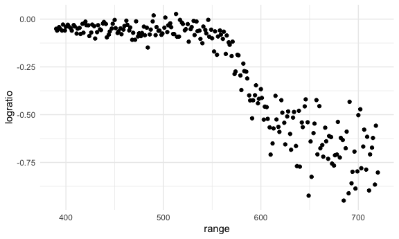

Cross Validation
================

``` r
library(tidyverse)
library(modelr)
library(mgcv)
```

    ## Loading required package: nlme

    ## 
    ## Attaching package: 'nlme'

    ## The following object is masked from 'package:dplyr':
    ## 
    ##     collapse

    ## This is mgcv 1.9-1. For overview type 'help("mgcv-package")'.

``` r
library(SemiPar)

set.seed(1)
```

look at LIDAR data

``` r
data("lidar")

lidar_df = 
  lidar |>
  as_tibble()|>
  mutate(id = row_number())
```

``` r
lidar_df|>
  ggplot(aes(x= range,y = logratio))+
  geom_point()
```



## try to do CV

3 models, one linear, one smooth, one wiggly

construct training testing df

``` r
train_df = 
  sample_frac(lidar_df, size = .8)
test_df = anti_join(lidar_df, train_df, by = "id")
```

``` r
ggplot(train_df, aes(x = range, y = logratio))+
  geom_point()+
  geom_point(data = test_df, color = "lightgreen")
```


fit three models

``` r
linear_mod = lm(logratio ~ range, data = train_df)
smooth_mod = gam(logratio ~ s(range), data = train_df)
wiggly_mod = gam(logratio ~ s(range, k = 30), sp= 10e-6, data = train_df)
```

look at fits

``` r
train_df |>
  add_predictions(linear_mod)|>
  ggplot(aes(x = range, y = logratio))+
  geom_point()+
  geom_point(data = test_df, color = "lightblue")+
  geom_line(aes(y = pred, color = "pink"))
```


``` r
train_df |>
  add_predictions(wiggly_mod)|>
  ggplot(aes(x = range, y = logratio))+
  geom_point()+
  #geom_point(data = test_df, color = "lightblue")+
  geom_line(aes(y = pred, color = "pink"))
```


``` r
train_df |>
  add_predictions(smooth_mod)|>
  ggplot(aes(x = range, y = logratio))+
  geom_point()+
  geom_point(data = test_df, color = "lightblue")+
  geom_line(aes(y = pred, color = "pink"))
```


compare these numerically using RMSE.

``` r
rmse(linear_mod, test_df)
```

    ## [1] 0.127317

``` r
rmse(smooth_mod, test_df)
```

    ## [1] 0.08302008

``` r
rmse(wiggly_mod, test_df)
```

    ## [1] 0.08848557

## repeat the trian/test split
