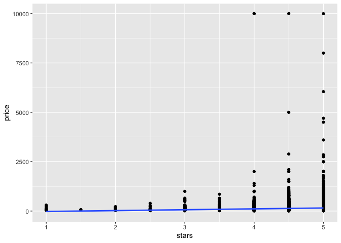
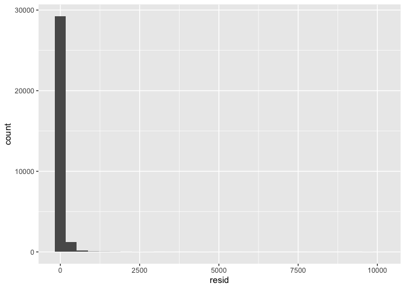
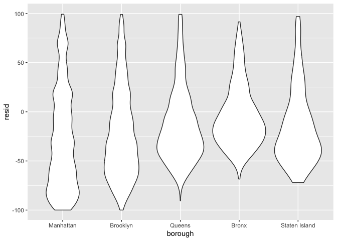
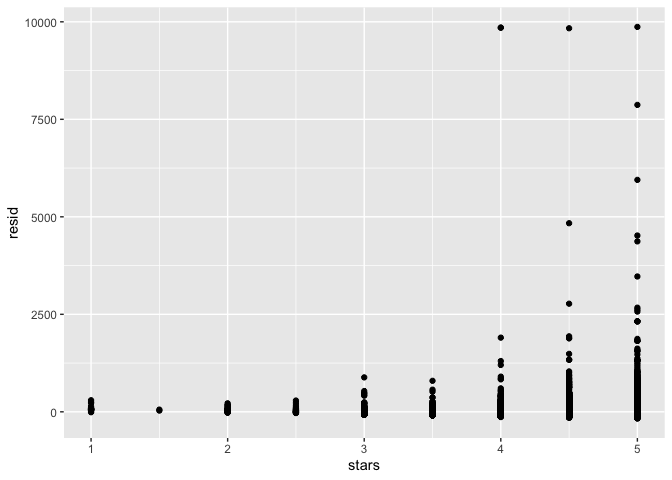
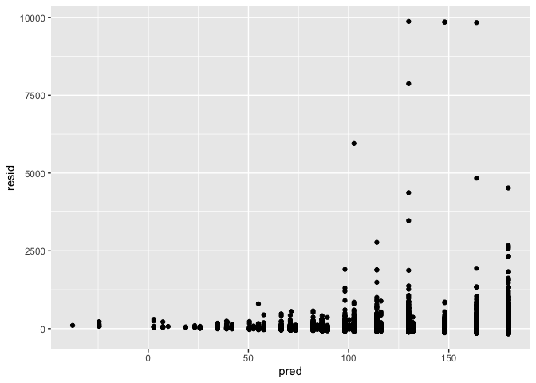

Linear Model
================

``` r
library(tidyverse)
```

    ## ── Attaching core tidyverse packages ──────────────────────── tidyverse 2.0.0 ──
    ## ✔ dplyr     1.1.4     ✔ readr     2.1.5
    ## ✔ forcats   1.0.0     ✔ stringr   1.5.1
    ## ✔ ggplot2   3.5.1     ✔ tibble    3.2.1
    ## ✔ lubridate 1.9.3     ✔ tidyr     1.3.1
    ## ✔ purrr     1.0.2     
    ## ── Conflicts ────────────────────────────────────────── tidyverse_conflicts() ──
    ## ✖ dplyr::filter() masks stats::filter()
    ## ✖ dplyr::lag()    masks stats::lag()
    ## ℹ Use the conflicted package (<http://conflicted.r-lib.org/>) to force all conflicts to become errors

``` r
library(p8105.datasets)

set.seed(1)
```

``` r
data("nyc_airbnb")

nyc_airbnb = 
  nyc_airbnb |>
  mutate(stars = review_scores_location / 2) |>
  rename(
    borough = neighbourhood_group, 
    neighbourhood = neighbourhood
  )|>
  filter(
    borough != "State Island"
  )|>
  select(price, stars, borough, neighbourhood, room_type)|>
  mutate(
    borough = fct_infreq(borough),
    room_type = fct_infreq(room_type)
  )
```

fit some models

``` r
fit = lm(price ~ stars, data = nyc_airbnb)

summary(fit)
```

    ## 
    ## Call:
    ## lm(formula = price ~ stars, data = nyc_airbnb)
    ## 
    ## Residuals:
    ##    Min     1Q Median     3Q    Max 
    ## -143.8  -68.8  -32.8   26.2 9889.2 
    ## 
    ## Coefficients:
    ##             Estimate Std. Error t value Pr(>|t|)    
    ## (Intercept)  -66.201     11.827  -5.597  2.2e-08 ***
    ## stars         43.992      2.502  17.584  < 2e-16 ***
    ## ---
    ## Signif. codes:  0 '***' 0.001 '**' 0.01 '*' 0.05 '.' 0.1 ' ' 1
    ## 
    ## Residual standard error: 183.3 on 30714 degrees of freedom
    ##   (10037 observations deleted due to missingness)
    ## Multiple R-squared:  0.009966,   Adjusted R-squared:  0.009934 
    ## F-statistic: 309.2 on 1 and 30714 DF,  p-value: < 2.2e-16

``` r
names(summary(fit))
```

    ##  [1] "call"          "terms"         "residuals"     "coefficients" 
    ##  [5] "aliased"       "sigma"         "df"            "r.squared"    
    ##  [9] "adj.r.squared" "fstatistic"    "cov.unscaled"  "na.action"

``` r
fit |>
   broom::tidy()|>
   select(term, estimate, p.value)
```

    ## # A tibble: 2 × 3
    ##   term        estimate  p.value
    ##   <chr>          <dbl>    <dbl>
    ## 1 (Intercept)    -66.2 2.20e- 8
    ## 2 stars           44.0 7.15e-69

``` r
fit = 
  lm(price~stars + borough, data = nyc_airbnb)

fit |>
  broom::tidy()|>
  select(term, estimate, p.value)|>
  mutate(
    term = str_replace(term,"borough", "Borough: ")
  )|>
  knitr::kable(digits = 3)
```

| term                   | estimate | p.value |
|:-----------------------|---------:|--------:|
| (Intercept)            |   20.818 |   0.086 |
| stars                  |   31.785 |   0.000 |
| Borough: Brooklyn      |  -49.782 |   0.000 |
| Borough: Queens        |  -77.075 |   0.000 |
| Borough: Bronx         |  -90.324 |   0.000 |
| Borough: Staten Island |  -76.628 |   0.000 |

``` r
nyc_airbnb|>
  ggplot(aes(x = stars, y = price))+
  geom_point()+
  stat_smooth(method = "lm")
```

    ## `geom_smooth()` using formula = 'y ~ x'

    ## Warning: Removed 10037 rows containing non-finite outside the scale range
    ## (`stat_smooth()`).

    ## Warning: Removed 10037 rows containing missing values or values outside the scale range
    ## (`geom_point()`).

<!-- -->

## some diagnostics

``` r
modelr::add_residuals(nyc_airbnb, fit)|>
  ggplot(aes(x = resid))+
           geom_histogram()
```

    ## `stat_bin()` using `bins = 30`. Pick better value with `binwidth`.

    ## Warning: Removed 10037 rows containing non-finite outside the scale range
    ## (`stat_bin()`).

<!-- -->

``` r
modelr::add_residuals(nyc_airbnb, fit)|>
  ggplot(aes(x = borough, y = resid))+
  geom_violin()+
  ylim(-100, 100)
```

    ## Warning: Removed 14869 rows containing non-finite outside the scale range
    ## (`stat_ydensity()`).

<!-- -->

Residual against stars

``` r
modelr::add_residuals(nyc_airbnb, fit)|>
  ggplot(aes(x = stars, y = resid))+
  geom_point()
```

    ## Warning: Removed 10037 rows containing missing values or values outside the scale range
    ## (`geom_point()`).

<!-- -->

``` r
nyc_airbnb |>
  modelr::add_residuals(fit) |>
  modelr::add_predictions(fit)|>
  ggplot(aes(x = pred, y = resid))+
  geom_point()
```

    ## Warning: Removed 10037 rows containing missing values or values outside the scale range
    ## (`geom_point()`).

<!-- -->
